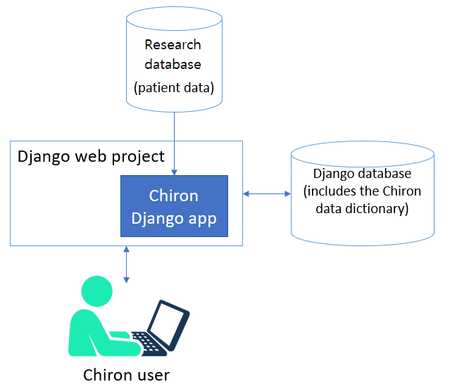

System Overview
===============

Code Architecture
-----------------

Chiron is a Django app. It can be embedded in a larger Django project or set up as a standalone system in a dedicated Django project.

There are a variety of ways to customize your Chiron instance:

- Global Chiron settings can be customized in your Django settings file.
- The Chiron data dictionary is stored in the database, and many basic modifications can be made here.
- Chiron uses Processor classes to perform many of its data-related tasks. For more advanced customization, you can write your own processor classes for specific datasets or fields.

You should avoid editing the Chiron code directly, as this makes it difficult to update as new versions are released. Your custom processor classes will be stored outside of the Chiron codebase.

Database Architecture
---------------------

Django requires a relational database, with a wide variety of systems supported. The relational database
is used to store Django system tables. Chiron also uses the relational database to store the chiron data dictionary, 
user info, and user-created content.

Chiron stores all patient/research data in its own research database. Even if your patient data is already
in Django models, it must first be pulled into the research database before Chiron can present it to the user.

Chiron uses the SQL Alchemy library and psycopg2 for connecting to the research database.
The Chiron app handles populating and querying the research database for you using the data dictionary.

